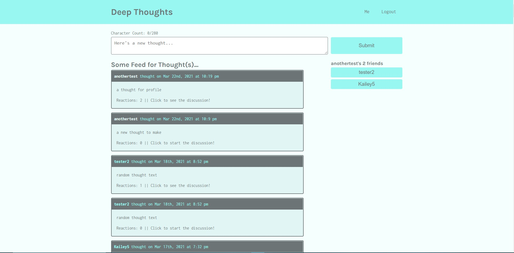
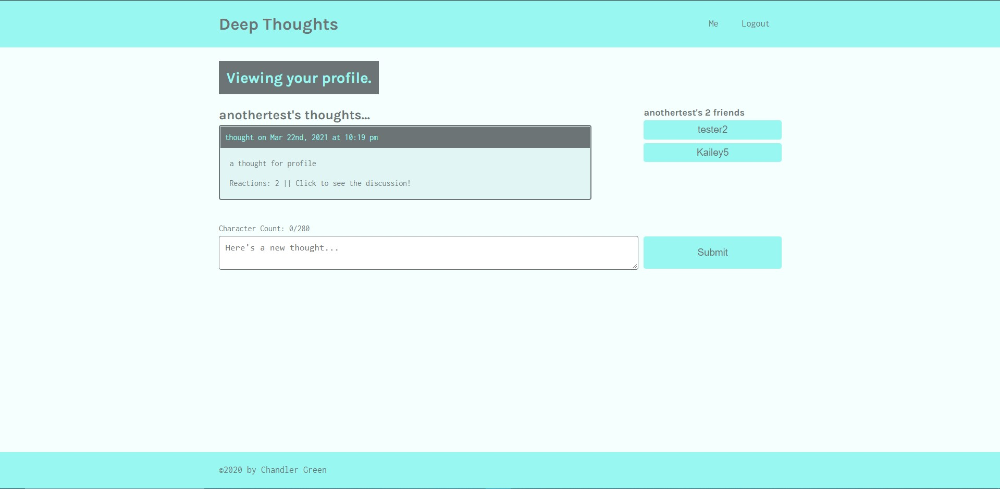

    

## Description

Deep Thoughts is a MERN stack social media application. This application allows users to view content in the form of 280 character thoughts and reactions. Once a user signs up for the application, they can post their own thoughts and reactions as well as add others to their friends list. logged in users stay authorized with a JSON Web Token that is stored on the client side. Thoughts, reactions and user data is stored in a MongoDB server, CRUD operations are performed through a graphQL API and the front end is powered by react, apollo react hooks, and React Router DOM.

## Table of Contents:
- [Description](#description)
- [Table of Contents:](#table-of-contents)
- [Installation](#installation)
- [Screenshot](#screenshot)
- [Credits](#credits)

## Installation 

This projects development environment is using the concurrently package to run both the database and client servers simultaneously. If you prefer to run two separate terminals, do not run 'npm start' in the root directory or change the scripts in the root directory's package.json file. 

## Screenshot

      

## Credits

Chandler Green  
            email: <chandlergreen1997@gmail.com>  
            phone-number: 832-792-4213  
            linkedIn: https://www.linkedin.com/in/chandleregreen/

